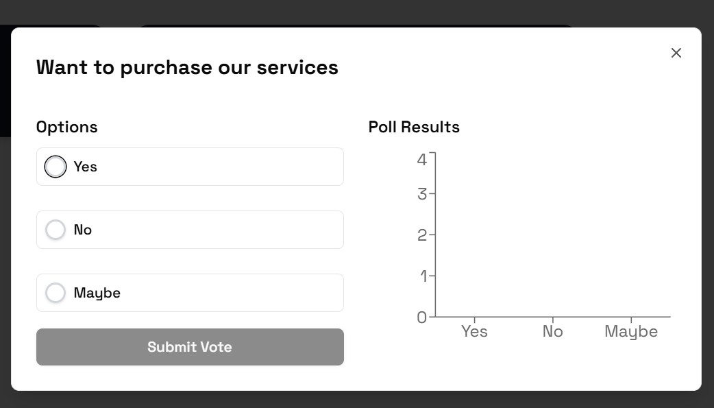

# 🗳️ Social Polling App (Pollify)

[](https://github.com/shreyasmulay23/social-polling-app/stargazers)
[](https://github.com/shreyasmulay23/social-polling-app/network)
[](https://github.com/shreyasmulay23/social-polling-app)
[](https://github.com/shreyasmulay23/social-polling-app/commits/main)
[](https://img.shields.io/website?url=http%3A//social-polling-app-seven.vercel.app/)
[](https://nodejs.org/)
[](https://vercel.com/)
[](https://www.typescriptlang.org/)
[](https://supabase.com/)
[](https://tailwindcss.com/)
[](https://opensource.org/licenses/MIT)
[](https://github.dev/shreyasmulay23/social-polling-app)


Create, vote, and engage with real-time polls. Built with **Next.js**, **Supabase**, and **Tailwind CSS**. Features
real-time updates, authentication, and interactive UI.

---

## 📸 Screenshots

| Home                                     | Poll                                         | Results                                      |
|------------------------------------------|----------------------------------------------|----------------------------------------------|
|  |  |  |

---

## 🔗 Live Demo

👉 [Live on Vercel](https://social-polling-app-seven.vercel.app)

---

## 🚀 Features

- 🔐 User authentication (Supabase)
- 🧑‍🤝‍🧑 Create and vote on polls
- 📊 Real-time vote updates via Supabase Realtime
- 🖼️ Clean, responsive UI (TailwindCSS + ShadCN)
- 🧠 Smart percentage calculations
- 🔄 Real-time update for poll edits and deletions

---

## 🧰 Tech Stack

- [Next.js 14 (App Router)](https://nextjs.org)
- [Supabase (Auth, Database, Realtime)](https://supabase.com)
- [Tailwind CSS](https://tailwindcss.com)
- [ShadCN UI](https://ui.shadcn.dev/)
- [Lucide Icons](https://lucide.dev/)
- [TypeScript](https://www.typescriptlang.org)

---

## 🛠️ Local Development

### 1. Clone the repository

```bash

git clone https://github.com/shreyasmulay/social-polling-app.git

cd social-polling-app
```

### 2. Install Dependencies

```bash

npm install

# or

yarn install
```

### 3. Set up environment variables

```bash

NEXT_PUBLIC_SUPABASE_URL=your_supabase_project_url
NEXT_PUBLIC_SUPABASE_ANON_KEY=your_supabase_anon_key
SUPABASE_SERVICE_ROLE_KEY=your_supabase_role_key
```

### 4. Run the development server

```bash

npm run dev
```

App should be running at http://localhost:3000.

---
## 📦 Folder Structure

```
/app
  └── (auth, dashboard, poll pages)
  /api
  └── poll, vote - REST API handlers
/components
  └── (PollCard, VoteForm, etc.)
/lib
  └── (supabase -- client.ts, server.ts, utils.ts)

```
---
## 📦 Deployment

This app is deployed using Vercel for the frontend and Render for the backend Node.js APIs.

- **Frontend (Next.js app)**: Automatically deployed via Vercel
    - Push to main → auto deploys to production
    - Push to other branches → deploys preview environments
- **Backend (Node.js API)**: Developed separately using Node.js and deployed on Render.com for handling poll and vote
  REST endpoints
- **⚙️ Fallback Option**: If there are any issues with the Node.js backend or Render deployment, you can use built-in
  Next.js API routes (under /app/api) to perform Supabase queries securely on the server side.

---

## 💡 Future Improvements

- Dark Mode Support
- Poll Expiry Timers
- Pagination or Infinite Scroll
- Sharing Polls via Link or QR
- Unit tests using Jest and React Testing Library
---
### 🐞 Known Issues

- 🕒 **Voting feedback is delayed for the user who casts the vote**. Other users see the updated vote count instantly,
  but the voter may notice a brief lag before their vote appears in the UI. (WIP)
- ✏️ **Poll updates (title + options) reflect partially for the creator**. The title updates instantly, but changes to
  poll options take time to appear unless refreshed. Other users see both updates in real time.
- 🧪 **No automated tests yet** — currently, no unit/integration test coverage. (WIP)

## 🙌 Acknowledgements

- Inspired by real-time voting apps and community feedback tools
- Thanks to Supabase and Vercel for the amazing developer tools
---
## 📄 License

MIT License © Shreyas Mulay

- Pull requests are welcome! Please open an issue first to discuss changes.
- Let me know if you'd like to auto-generate screenshots from your app or if you want a separate `CONTRIBUTING.md` too?
---